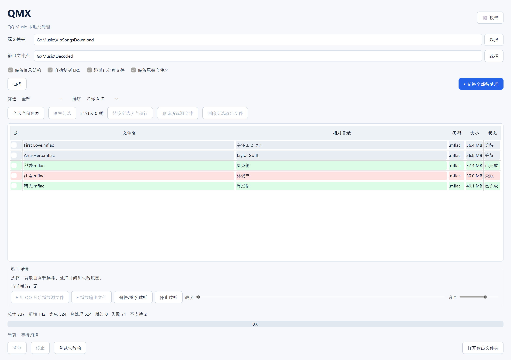

<p align="center"></p>

<h1 align="center">QMX</h1>

<p align="center"><strong>Windows x64 本地音乐库管理与批量处理工具</strong></p>

<p align="center"><a href="README_EN.md">English</a></p>

<p align="center"></p>

QMX 是一款面向 Windows 10/11 x64 的本地音乐文件管理和批量处理软件。它提供图形界面递归扫描音乐库，保留歌手与专辑目录结构、同步复制 LRC 歌词、记录处理历史，并调用用户本机单独安装的 `qmdec` 命令行程序处理文件。适合需要整理本地音乐文件、批量处理歌曲并追踪处理状态的用户。

每次扫描都会对照源文件版本、SQLite 记录和输出音频的实际可读性；已存在且有效的结果会恢复显示为“已完成”，输出缺失或损坏时则显示待处理或失败，避免把已成功解码的文件反复列为失败。

如果你正在搜索 Windows 本地音乐管理工具、音乐文件批量处理软件、音乐库整理工具、支持 LRC 歌词复制的批处理程序，或 qmdec 图形界面，QMX 提供本地扫描、批量操作和 SQLite 历史记录。QMX 是 `qmdec` 的桌面管理界面，不包含其处理引擎。

## 下载

前往 [GitHub Releases 下载页](https://github.com/mondeharuo/QMX/releases)，下载 0.2.0：

- **`QMX-Setup-x64-v0.2.0.exe`**：Windows 用户级安装程序，不需要管理员权限。
- **`QMX-windows-x64-v0.2.0.zip`**：便携版。解压整个压缩包后运行 `QMX.exe`。

程序面向 64 位 Windows。安装程序目前没有商业代码签名证书，Windows SmartScreen 可能显示标准的首次运行提示。

## 功能

- 递归扫描源目录，保留歌手、专辑等子目录结构。
- 保留原始音频 basename，仅按实际输出格式更换扩展名。
- 将同名 `.lrc` 按字节原样复制到输出目录。
- 使用 SQLite 记录处理状态，重复扫描时跳过有效的已处理文件。
- 使用 `ffprobe` 检查输出音频；不覆盖已有输出文件。
- 转换时将源文件视为只读，所有生成文件写入输出文件夹；界面提供明确区分源文件和输出文件的手动删除操作，并在执行前要求确认。
- 支持勾选单首或多首分别转换，或单独删除所选源文件、输出文件，并在确认前说明删除对象。
- 支持失败优先等排序、状态筛选、处理历史查看、文件位置定位和音频试听。

> 请仅处理你有权访问的文件。QMX 不包含或重写 `qmdec` 的文件处理实现，也不隶属于 QQ 音乐或 `qmdec` 项目。

## 使用前准备

- Windows 10 或更新版本，x64。
- 单独安装并配置 [`qmdec`](https://github.com/Sophomoresty/qmdec)，按其官方说明完成所需设置。
- 安装 FFmpeg 并确保 `ffprobe.exe` 可用。QMX 会检查 PATH 和常见的 WinGet 安装位置；若没有自动找到，可在“设置”中指定 `ffprobe.exe`。

QMX 不会要求你把账号密码、Cookie 或 Token 发给本项目。若 `qmdec` 需要认证，请在本机按其官方流程操作。

## 快速开始

1. 安装上述依赖。
2. 解压便携 ZIP，或运行安装程序。
3. 启动 QMX，检查源目录和输出目录。
4. 点击“扫描”，检查扫描结果。
5. 确认后点击“开始处理”。

默认源目录为 `G:\Music\VipSongsDownload`，默认输出目录为 `G:\Music\Decoded`。设置按 Windows 用户保存。处理数据库和滚动日志保存在程序目录下的 `data` 与 `logs` 文件夹中。

## 从源码构建

需要 Python 3.10 或更新版本，推荐使用 64 位 Python：

```powershell
python -m venv .venv
.\.venv\Scripts\python.exe -m pip install -r requirements.txt
.\build.bat
```

安装 Inno Setup 6 后，可使用以下命令同时生成便携 ZIP 和安装程序：

```powershell
powershell -ExecutionPolicy Bypass -File .\build_release.ps1
```

生成文件放在 `release` 目录。发布包不包含本地数据库、日志、歌曲文件、`qmdec` 或 FFmpeg。

## 项目状态与反馈

这是早期版本。0.2.0 面向 Windows x64，不提供 x86 构建。反馈问题时请提供版本号和已清理个人信息的错误摘要；请勿上传加密歌曲、Cookie、Token 或账号凭据。

## 许可证

QMX 尚未选择项目许可证。添加许可证前，仓库内容仅供查看，不授予复制、修改或再分发权限。随程序分发的第三方组件许可证见 [`THIRD_PARTY_NOTICES.md`](THIRD_PARTY_NOTICES.md)。
